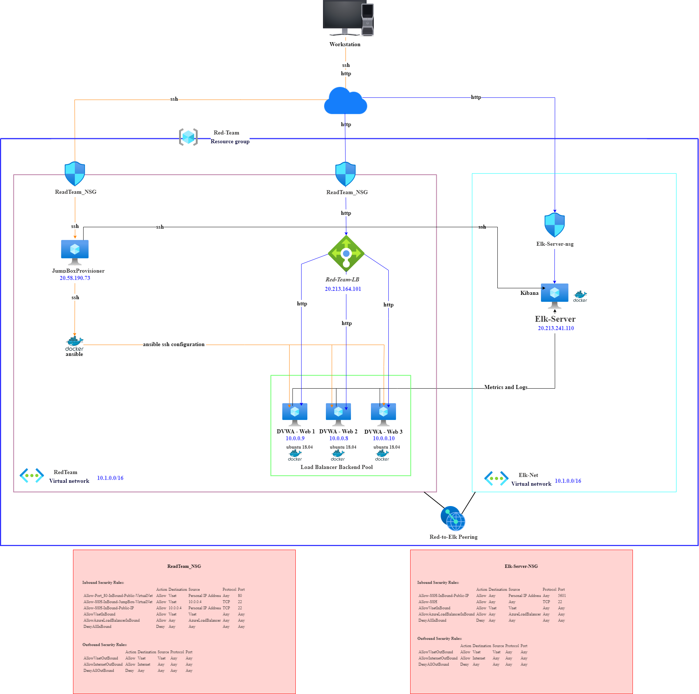
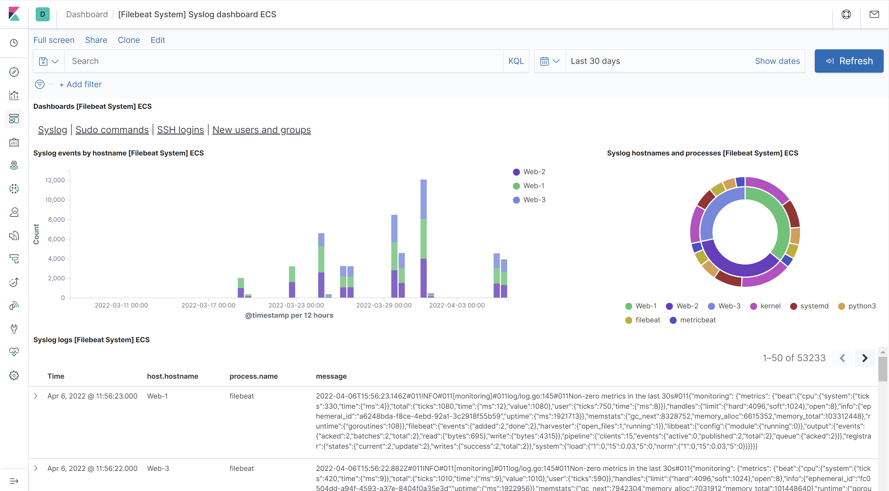
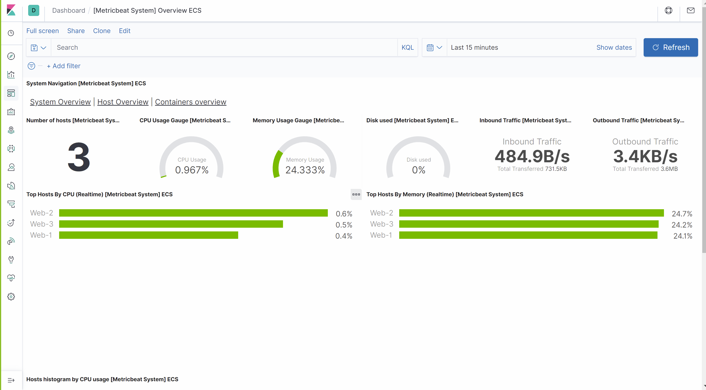

## Automated ELK Stack Deployment

The files in this repository were used to configure the network depicted below.

These files have been tested and used to generate a live ELK deployment on Azure. They can be used to either recreate the entire deployment pictured above. Alternatively, select portions of the pentest.yml file may be used to install only certain pieces of it, such as Filebeat.

---
- name: Config Web VM with Docker
  hosts: webservers
  become: true
  tasks:
  - name: docker.io
    apt:
      force_apt_get: yes
      update_cache: yes
      name: docker.io
      state: present

  - name: Install pip3
    apt:
      force_apt_get: yes
      name: python3-pip
      state: present

  - name: Install Docker python module
    pip:
      name: docker
      state: present

  - name: download and launch a docker web container
    docker_container:
      name: dvwa
      image: cyberxsecurity/dvwa
      state: started
      published_ports: 80:80

  - name: Enable docker service
    systemd:
      name: docker
      enabled: yes

This document contains the following details:
- Description of the Topologu
- Access Policies
- ELK Configuration
  - Beats in Use
  - Machines Being Monitored
- How to Use the Ansible Build

### Description of the Topology

The main purpose of this network is to expose a load-balanced and monitored instance of DVWA, the D*mn Vulnerable Web Application.

Load balancing ensures that the application will be highly reliable, in addition to restricting traffic to the network.

- Load balancers can defend against denial-of-service (DDos) attacks. Having a jumpbox that has hardened security allows you to manage other systems within your security or network.

Integrating an ELK server allows users to easily monitor the vulnerable VMs for changes to the file logs and system metrics.
- Filebeat monitors specified log files or locations, collects log events.
- It records machine metrics and stats, such as uptime.

The configuration details of each machine may be found below.

| Name        | Function      | IP Address                      | Operating System  |
|-------------|---------------|---------------------------------|-------------------|
| Workstation | Access Control| My personal IP Address (My IP)  | Windows           |
| JumpBox     | Gateway       | 10.0.0.4/20.58.190.73           | Linux             |
| Web 1       | Webserver     | 10.0.0.9/20.213.164.101         | Linux             |
| Web 2       | Webserver     | 10.0.0.8/20.213.164.101         | Linux             |
| Web 3       | Webserver     | 10.0.0.10/20.213.164.101        | Linux             |
| Elk         | Monitoring    | 10.1.0.4/20.213.241.110         | Linux             |

### Access Policies

The machines on the internal network are not exposed to the public Internet. 

Only the Elk machine can accept connections from the Internet. Access to this machine is only allowed from the following IP addresses:
- My personal IP address via TCP port 5601

Machines within the network can only be accessed by Workstation via the JumpBoxProvisioner.
- The JumpBoxProvisioner has access to the ELK VM and its IP address is 20.58.190.73

A summary of the access policies in place can be found in the table below.

| Name     | Publicly Accessible | Allowed IP Addresses    |
|----------|---------------------|-------------------------|
| JumpBox  | Yes/No              | My IP                   | 
| Web 1    | No                  |                         | 
| Web 2    | No                  |                         | 
| Web 3    | No                  |                         | 
| Elk      | Yes/No              | My IP/20.58.190.73      | 

### Elk Configuration

Ansible was used to automate configuration of the ELK machine. No configuration was performed manually, which is advantageous because...
- It allows you to easily configure new machines, update programs on multiple machines/servers at once.

The playbook implements the following tasks:
- Install Docker
- Install python3-pip
- Install Docker python module
- Set the vm.max_map_count to 262144
- Download and launch a docker elk container

The following screenshot displays the result of running `docker ps` after successfully configuring the ELK instance.

### Target Machines & Beats
This ELK server is configured to monitor the following machines:
- Web 1 10.0.0.9 
- Web 2 10.0.0.8
- Web 3 10.0.0.10

We have installed the following Beats on these machines:
- Filebeat 
- Metricbeat

These Beats allow us to collect the following information from each machine:
- Filebeat monitors specified log files or locations, collects log events, and then forwards it to the Elk server.

- Metricbeat collect metrics from systems and service e.g., memory usage of a hosting server. It can also be used to monitor other beats.
 

### Using the Playbook
In order to use the playbook, you will need to have an Ansible control node already configured. Assuming you have such a control node provisioned: 

SSH into the control node and follow the steps below:
- Copy the playbook (ex: filebeat-playbook.yml or instal_elk.yml) file to the Ansible (ect/Ansible) directory. 
- Update the host file to include webserver and ELK.

nano /etc/ansible/hosts

 "# /etc/ansible/hosts
 [webservers]
 10.0.0.4 ansible_python_interpreter=/usr/bin/python3
 10.0.0.5 ansible_python_interpreter=/usr/bin/python3
 10.0.0.6 ansible_python_interpreter=/usr/bin/python3

 [elk]
 10.1.0.4 ansible_python_interpreter=/usr/bin/python3"

- Update the Ansible configuration file /etc/ansible/ansible.cfg using and set the remote_user parameter to the admin user of the web servers.

nano /etc/ansible/ansible.cfg

Uncomment the remote_user line and replace root with your admin username using this format:
- remote_user = <user-name-for-web-VMs>

"# What flags to pass to sudo
# WARNING: leaving out the defaults might create unexpected behaviours
#sudo_flags = -H -S -n

# SSH timeout
#timeout = 10

# default user to use for playbooks if user is not specified
# (/usr/bin/ansible will use current user as default)
remote_user = sysadmin

# logging is off by default unless this path is defined
# if so defined, consider logrotate
#log_path = /var/log/ansible.log

# default module name for /usr/bin/ansible
#module_name = command"

- Run the playbook filebeat-playbook.yml (/etc/ansible/roles/filebeat-playbook.yml), and navigate to Kibana (http://20.213.241.110:5601/app/kibana#/home) to check that the installation worked as expected.

